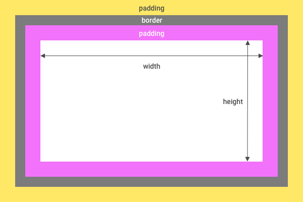

# 2.1 Box model

All elements in CSS are based on the same box model. This model defines the dimensions of the element.

## Content

- [Width and height](#width-and-height)
- [Padding](#Padding)
- [Borders](#borders)
- [Margin](#margin)

---

## Width and height

`width` and `height` define the width and height of the content box. The content box is the wrapper
which includes text and child boxes.

---

## Padding

`padding` is the inner spacing of a box. It sits inside the content box and around the actual content.

---

## Border

The `border` of the box sit on the outside of the content box. Default it is not visible but it can be enabled with
the `border` property.

---

## Margin

If you specify `margin` on a certain element you'll add some spacing around the element, or in other words you'll push other elements away from your element.

> Margins can "collapse". This means that when 2 boxes touch, the space between them is the largest of the 2 margins.
