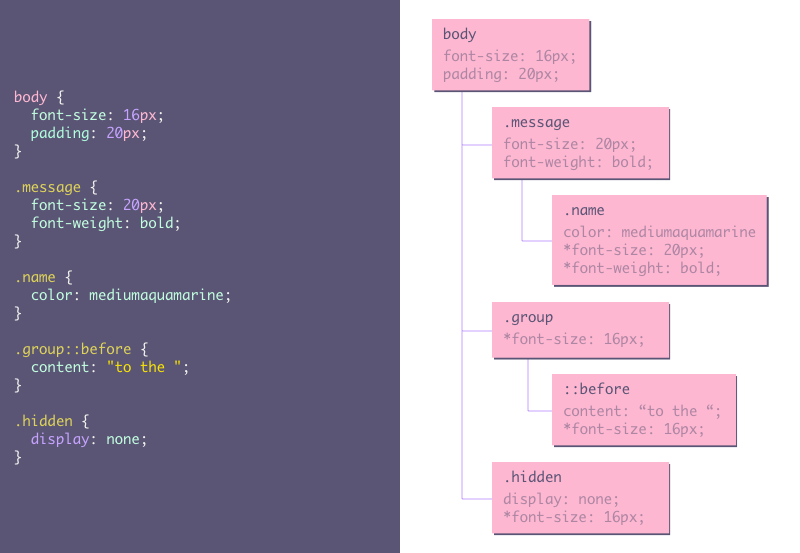

# 5.1 DOM and CSSOM

Before the browser can render the page it needs to construct the DOM and CSSOM trees. In this chapter we will take a
closer look at both object models.

## Content

- [DOM](#dom)
- [CSSOM](#cssom)

---

## DOM

When the browser receives your HTML file it will start constructing the DOM tree. This process can be split into 4 steps:

### Conversion

The browser reads the raw bytes of the HTML off the disk or network and translates them to individual characters based
on specified encoding of the file (e.g. UTF-8).

### Tokenizing

The browser converts strings of characters into distinct tokens specified by the W3C HTML5 standard. Each token has a
special meaning and a set of rules.

### Lexing

The emitted tokens are converted into “objects” which define their properties and rules.

### DOM construction

Finally, because the HTML markup defines relationships between different tags (some tags are contained within tags)
the created objects are linked in a tree data structure that also captures the parent-child relationships defined in the
original markup.

_The DOM tree tells us which elements should be rendered._

#### Example

## CSSOM

Just like with HTML, the browser converts the received CSS files into something it can understand and work with. The CSS
bytes are converted into characters, then to tokens and nodes, and finally are linked into a tree structure known as the
"CSS Object Model", or CSSOM for short.

The tree structure allows the browser to start with the most general rule and refine the computed styles by going down
the tree to more specific rules. The tree uses the cascading principle, combining inheritance and specificity to compute
the styles for the different objects on the page.

_The CSSOM tree tells us how the different elements should look when rendered._

#### Example

