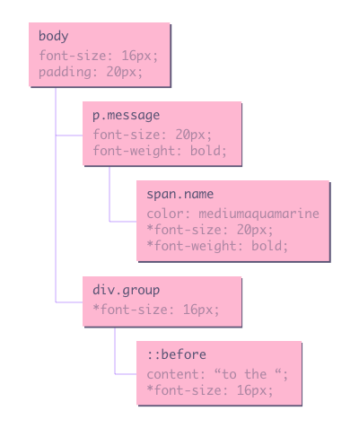

# 5.2 Pixel pipeline

Now that the browser knows which elements should be rendered and how these elements should look like when rendered, it
can finally start rendering the elements.

The DOM tree and the CSSOM tree are combined into the render tree, which knows everything it needs to know to start
painting pixels on the screen.

## Content

- [Pixel pipeline](#pixel-pipeline)
- [JavaScript](#javascript)
- [Style](#style)
- [Layout](#layout)
- [Paint](#paint)
- [Composite](#composite)
- [Performance](#performance)

---

## Pixel pipeline

The pixel pipeline has 5 major steps to go through before a pixel is rendered on the screen.

## JavaScript

First of all the JavaScript stage happens. Since it can be used for adding/removing elements, updating styles etc we need
it done before starting anything else.

## Style

To construct the render tree in the style step, the browser goes trough following steps.

Starting from the root node the browser constructs a new tree that only contains visible nodes. Some nodes are never
visible (scripttags, metatags, ...), some nodes are hidden via CSS (mark that `visibility: hidden` hides a node but
still influences the layout, these nodes are still taken into account in the render tree).

For every visible node, the browser will check the CSSOM to apply the style rules that match the node.

With the render tree in place, we can proceed to the `layout` stage.

### What it looks like

## Layout

Now that we know which elements have to be rendered and which style rules should be applied to them we can start
calculating the exact position of each node within the viewport of the device. Again the browser starts at the root node
and converts all relative units to absolute pixels. The output is often referred to as the 'box model'.

---

## Paint

So, now we know which elements should be visible, which style rules are applied to these elements, and the absolute
size of each element. Based on this information the browser is able to convert the render tree to actual pixels on the
screen.

This process is often referred to as 'Painting' or 'Rasterizing'.

---

## Composite

This stage renders the pixels in multiple layers, needed for overlapping elements.

---

## Performance

Each step and each calculation that has to be done takes up a reasonable amount of time. It is important to know that
when updating the DOM or CSSOM (for example via javascript) the entire process has to be repeated.

### Some examples:

If you change a property that changes the layout of a page such as `width`, `height`, `margin`, ... the browser needs to go
through all the steps of the pixel pipeline.

If you change a paint only property like `color`, `background-color`, `box-shadow`, ... the browser knows it can skip the layout
stage. This results in big perfomance win.

If you go even further and change something that does not require Layout or Paint, the browser jumps to composite step
immediately.

Knowing which property triggers which step is something you'll learn while doing. A list of the affected steps per
property can be found at [csstriggers.com](https://csstriggers.com/).
